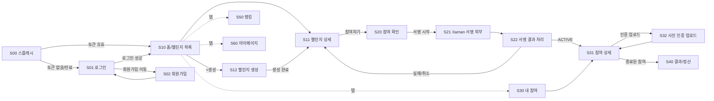
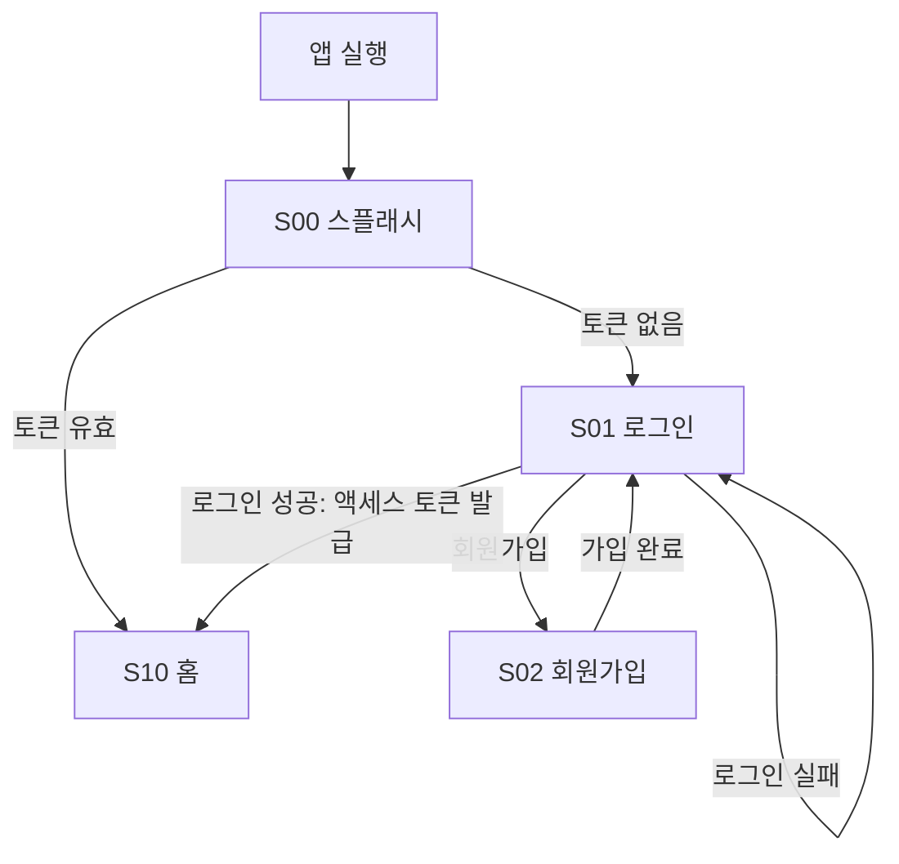
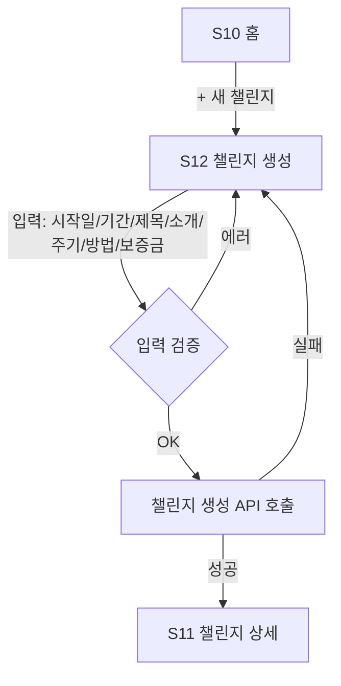
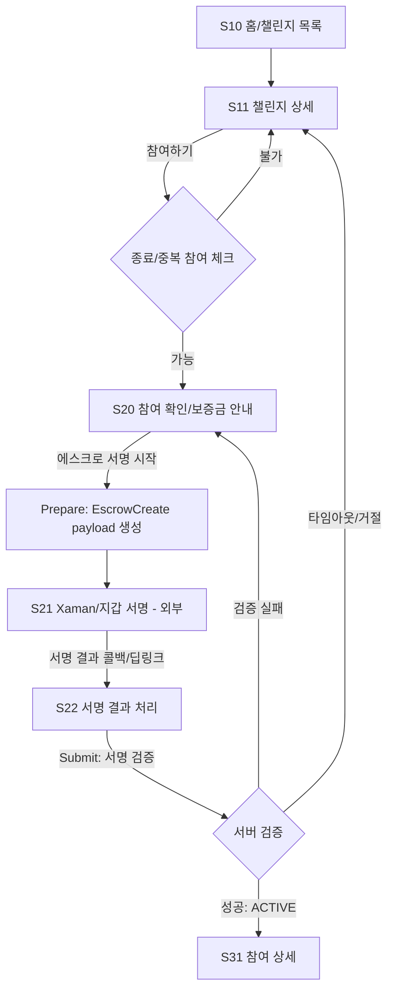
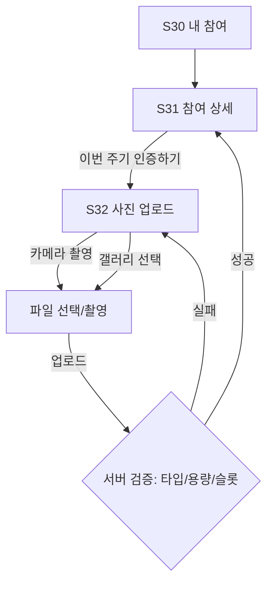
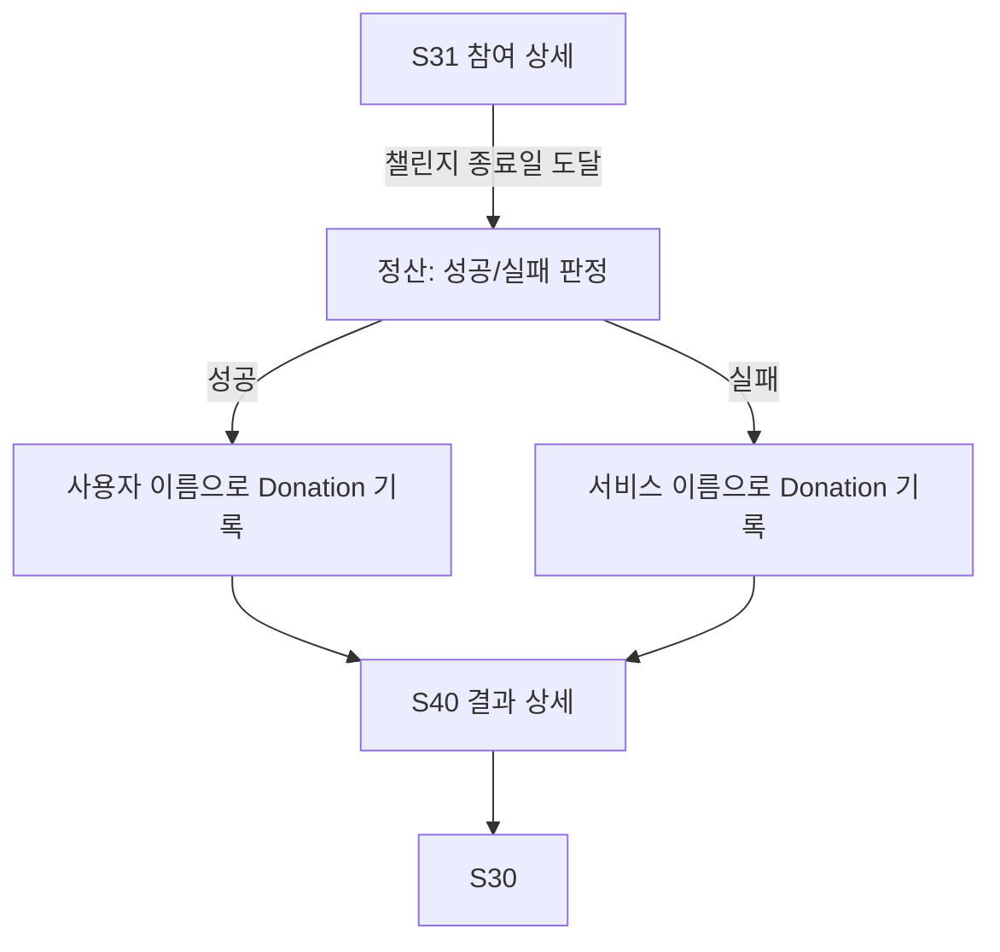
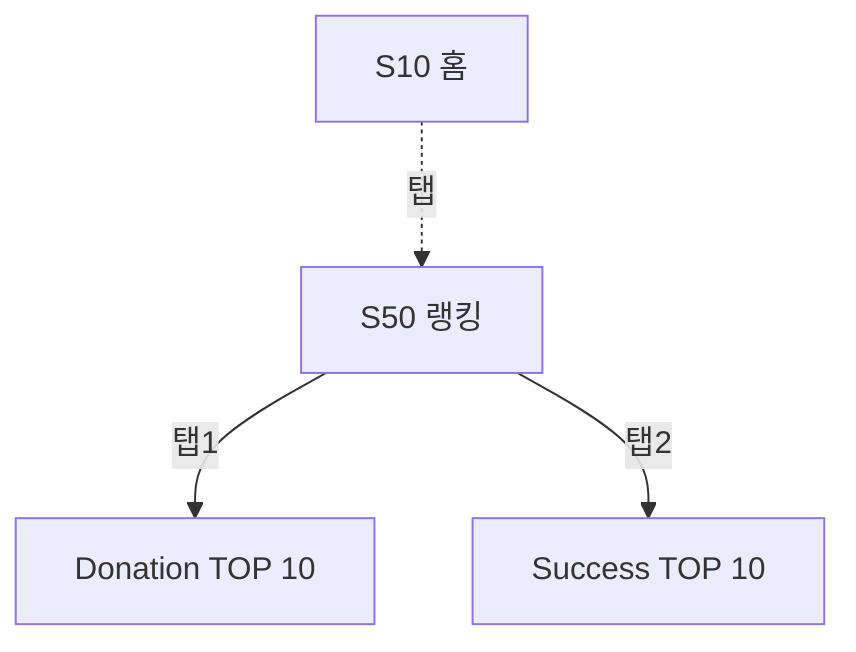

# Habit Bridge Demo — 앱 화면 이동 흐름 (MVP)

본 문서는 [요구사항 문서](./requirements.md)를 바탕으로, MVP 범위의 모바일/웹 앱에서 사용자가 거치게 되는 **화면 구성과 이동 흐름**을 정리한다. 서버 API 단위가 아닌 **UX 관점의 네비게이션**을 기준으로 한다.

---

## 1. 화면 목록 (Screen Inventory)

| ID | 화면명 | 설명 | 접근 권한 |
|----|--------|------|-----------|
| S00 | 스플래시 | 토큰 유효성 확인 후 분기 | 누구나 |
| S01 | 로그인 | 이메일 + 비밀번호 로그인 | 비로그인 |
| S02 | 회원가입 | 계정 생성 | 비로그인 |
| S10 | 홈 / 챌린지 목록 | 종료되지 않은 챌린지 리스트 (참여 가능) | 로그인 |
| S11 | 챌린지 상세 | 챌린지 정보 + 참여 버튼 | 로그인 |
| S12 | 챌린지 생성 | 시작일/기간/보증금 등 입력 | 로그인 |
| S20 | 참여 확인 (보증금 안내) | 보증금 안내 및 에스크로 서명 시작 | 로그인 |
| S21 | Xaman 서명 (외부) | Xaman/XRPL 지갑 서명 화면 (외부 앱) | 로그인 |
| S22 | 서명 결과 처리 (Pending) | 서명 결과 폴링/확인 | 로그인 |
| S30 | 내 참여 목록 | 진행 중/종료된 참여 리스트 | 로그인 |
| S31 | 참여 상세 / 인증 슬롯 | 인증 진행 현황 + 업로드 진입 | 로그인 |
| S32 | 사진 인증 업로드 | 날짜 포함 사진 촬영/선택 후 업로드 | 로그인 |
| S40 | 결과(정산) 상세 | 성공/실패 + 기부 귀속 결과 | 로그인 |
| S50 | 랭킹 | Donation TOP 10 / Success TOP 10 탭 | 로그인 |
| S60 | 마이페이지 | displayName, XRPL 주소 설정 | 로그인 |

> 권한: "로그인"은 액세스 토큰이 유효한 상태. 토큰 만료 시 모든 화면에서 **S01 로그인**으로 강제 이동한다.

---

## 2. 전체 네비게이션 맵

---

## 3. 시나리오별 흐름

### 3.1 회원가입 / 로그인 흐름

요구사항: §3.1, §4.1

- **S01 로그인 성공** 시 토큰을 저장하고 **S10 홈**으로 이동.
- **displayName 미설정** 사용자는 최초 로그인 후 **S60 마이페이지**로 한 번 유도(선택 정책)할 수 있다.

---

### 3.2 챌린지 생성 흐름

요구사항: §3.2, §4.2

- 입력 항목: 시작일, 기간(주), 제목, 소개, 인증 주기, 인증 방법 설명, 보증금(XRP).
- 생성 완료 후 자동으로 **S11 챌린지 상세**로 이동하여 즉시 공유/참여 안내 가능.

---

### 3.3 챌린지 참여 + XRP 에스크로 흐름 (핵심)

요구사항: §3.3, §4.4

상태 매핑(참여 상태 ↔ 화면):

| 참여 상태 | 표시 화면 |
|-----------|-----------|
| `PENDING_DEPOSIT` | S20 참여 확인 (재시도 진입 가능) |
| `DEPOSIT_SUBMITTED` | S22 서명 결과 처리 (폴링) |
| `ACTIVE` | S31 참여 상세 |
| `COMPLETED_SUCCESS` / `COMPLETED_FAIL` | S40 결과 |
| `CANCELLED` | S30 내 참여 (취소 표시) |

UX 포인트:

- **S21**은 외부 앱(Xaman) 또는 외부 브라우저로의 이탈이 발생하므로, **딥링크 복귀** 또는 **서명 상태 폴링**을 모두 지원해야 한다.
- **S22**는 사용자가 앱을 다시 켰을 때도 진입할 수 있어야 하며, 동일 요청에 대한 **멱등 처리**가 보장돼야 한다.

---

### 3.4 사진 인증 업로드 흐름

요구사항: §3.4, §4.5

- **S31 참여 상세**에는 다음을 표시한다.
  - 현재까지 완료한 인증 수 / 남은 인증 수
  - 현재 주기의 인증 가능 여부(이미 완료/대기/마감)
  - 인증 슬롯(주차/일자) 리스트
- 인증 가능한 슬롯이 없으면 **인증 버튼은 비활성화**된다.

---

### 3.5 종료 / 정산 / 기부 귀속

요구사항: §3.5, §4.6

- 정산 결과는 변경 불가하므로 **S40**는 읽기 전용.
- **S40**에는 다음을 표시한다.
  - 성공/실패 라벨
  - 기부 귀속 표기(예: "홍길동 님 이름으로 기부" / "Habit Bridge 서비스 이름으로 기부")
  - 보증금 금액 및 원본 챌린지 링크(S11)

---

### 3.6 랭킹 흐름

요구사항: §3.6, §4.7

- 두 개의 탭(또는 세그먼트)으로 구성한다.
- 각 랭킹 항목 클릭 시 별도 프로필 화면이 없는 MVP에서는 동작 없음(후순위).

---

## 4. 글로벌 네비게이션 규칙

1. **하단 탭(Bottom Tab) 구조(권장)**

   | 탭 | 화면 |
   |----|------|
   | 홈 | S10 챌린지 목록 |
   | 내 참여 | S30 내 참여 목록 |
   | 랭킹 | S50 랭킹 |
   | 마이 | S60 마이페이지 |

2. **챌린지 생성(S12)** 진입은 홈(S10)의 상단 우측 `+` 액션으로 한정한다.

3. **인증 만료 / 401 처리**
   - 어떤 화면에서든 토큰 만료가 감지되면, 현재 스택을 비우고 **S01 로그인**으로 이동한다.

4. **외부 앱 복귀 처리(S21 → S22)**
   - Xaman 서명 후 딥링크로 복귀하면 **참여 ID + 요청 식별자**를 기반으로 **S22**에서 결과를 폴링한다.
   - 사용자가 앱을 다시 열었을 때 `DEPOSIT_SUBMITTED` 상태의 참여가 있으면 자동으로 **S22**를 띄울 수 있다.

5. **뒤로가기 / 닫기 정책**
   - **S22 서명 결과 처리** 중에는 뒤로가기를 막거나 "백그라운드에서 계속 진행" 안내 후 **S30**로 이동.
   - **S32 사진 업로드** 중에는 업로드 진행률이 있을 때 확인 다이얼로그를 띄운다.

6. **빈 상태(Empty State)**
   - **S10**: 종료되지 않은 챌린지가 없으면 "새 챌린지 만들기" CTA 노출.
   - **S30**: 참여 이력이 없으면 "홈에서 챌린지에 참여해보세요" CTA → S10으로 이동.

---

## 5. 화면 ↔ 요구사항 매트릭스

| 화면 | 관련 요구사항 절 |
|------|------------------|
| S01, S02 | §3.1, §4.1 |
| S10, S11, S12 | §3.2, §4.2 |
| S20, S21, S22 | §3.3, §4.3, §4.4 |
| S31, S32 | §3.4, §4.5 |
| S40 | §3.5, §4.6 |
| S50 | §3.6, §4.7 |
| S60 | §4.1 (프로필) |

---

## 6. MVP 범위 외(후순위) UX

[요구사항 §6](./requirements.md) 의 후순위 항목과 매핑된다.

- **자동 진위 판별 결과 표시 UI** (S32 업로드 후 결과 화면)
- **온체인 송금 완료 표시** (S40에 트랜잭션 해시/탐색기 링크)
- **관리자 화면** (분쟁/수동 승인, 별도 권한 흐름)
